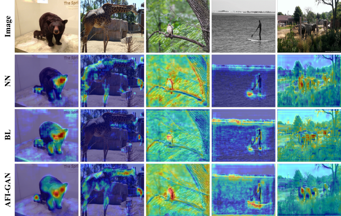

## [AFI-GAN: Improving Feature Interpolation of Feature Pyramid Networks via Adversarial Training for Object Detection](https://github.com/inhavl-shlee/AFI-GAN)

A novel **feature interpolator** which can substitude for existing interpolation methods

This is the code page for our papers and implemented based on [detectron2](https://github.com/facebookresearch/detectron2).

## Abstract

Recent convolutional object detectors learn strong semantic features by combining features propagated from multiple pathways. 
To combine features with different resolutions,  coarser feature maps  are upsampled by using the simple interpolation (*e.g.,* nearest neighbor and bilinear) method. 
However, the simple interpolation incurs often noisy and blurred features. 
To resolve this, we propose a novel adversarially-trained interpolator, and which can substitute for the traditional interpolation effortlessly. 
In specific, we  design  AFI-GAN consisting of an AF interpolator and a feature patch discriminator. 
For generic and target-specific AF learning, we design AFI-GAN losses and train an AF interpolator by minimizing the discrepancy between upsampled and target features and the losses for target detection tasks. 
In particular, we combine the proposed AFI-GAN with the recent multi-scale  networks (i.e., BiFPN, PAFAN, FPN) and detectors (i.e., FCOS, CenterMask, Cascade R-CNN, RetinaNet, Mask R-CNN, and Faster-RCNN). 
From the  extensive studies, we prove the effectiveness and flexibility of our AF interpolator, and achieve the better box and masks APs by **2.2%** and **1.6%** on average compared to the same detectors using other interpolation.

### Highlights

* **Adversarially-trained feature interpolator:** For robust multi-scale object detection, the AF interpolator generates high quality of up-sampled features. To this end, we learn this interpolator via adversarial learning.
* **Progressive adversarial learning:** In order to avoid networks overfitted and improve the interpolation ability of AFI-GAN step-by-step for a specific detection task, we present progressive adversarial learning.
* **Substituting simple interpolation modules:** Substituting a simple interpolation module of multi-scale feature extractor (*e.g.* FPN, PAFPN, and BiFPN) with the AF interpolator achieves the accuracy improvements over using simple interpolation modules.
* **High flexibility over different backbones and detectors:** In practical, the AF interpolator is feasible to reuse although it is trained with other backbones and detection heads (*e.g.* RetinaNet, Faster R-CNN, Mask R-CNN, Cascade R-CNN, FCOS, and CenterMask).

### COCO test-dev results

|interpolation|Detection Head|Backbone|box AP|mask AP|
|:-------------:|:--------:|:--------:|:----:|:----:|
|NN|FCOS|R-50-FPN|39.7|-|
|NN|FCOS|R-50-BiFPN|40.6|-|
|NN|Mask R-CNN|R-50-FPN|39.0|35.5|
|NN|Mask R-CNN|R-50-PAFPN|39.0|35.6|
|NN|CenterMask|R-50-BiFPN|40.6|35.8|
|NN|Cascade R-CNN|S-101-PAFPN|48.6|41.9|
||
|**AFI**|**FCOS**|R-50-FPN|**42.6**|-|
|**AFI**|**FCOS**|R-50-BiFPN|**43.9**|-|
|**AFI**|**Mask R-CNN**|R-50-FPN|**41.5**|**37.4**|
|**AFI**|**Mask R-CNN**|R-50-PAFPN|**40.9**|**36.9**|
|**AFI**|**CenterMask**|R-50-BiFPN|**43.8**|**38.2**|
|**AFI**|**Cascade R-CNN**|S-101-PAFPN|**49.4**|**42.6**|
|**AFI**|**Cascade R-CNN (TTA)**|S-101-PAFPN|**51.6**|**44.7**|
* NN and AFI denote a nearest-neighbor interpolation method and the proposed method, respectively.
* All detectors are trained for about 12 COCO epochs
* S and TTA denote <a href="https://arxiv.org/abs/2004.08955">ResNeSt</a> backbone networks and multi-scale testing results, respectively.

## Qualitative Results

### Detection and Segmentation Results on COCO test-dev

### Interpolation Method Comparison using GCAM

