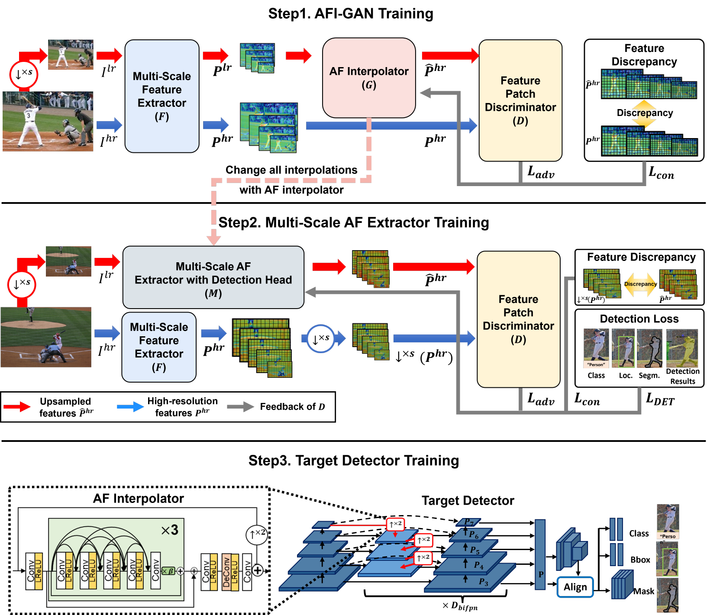
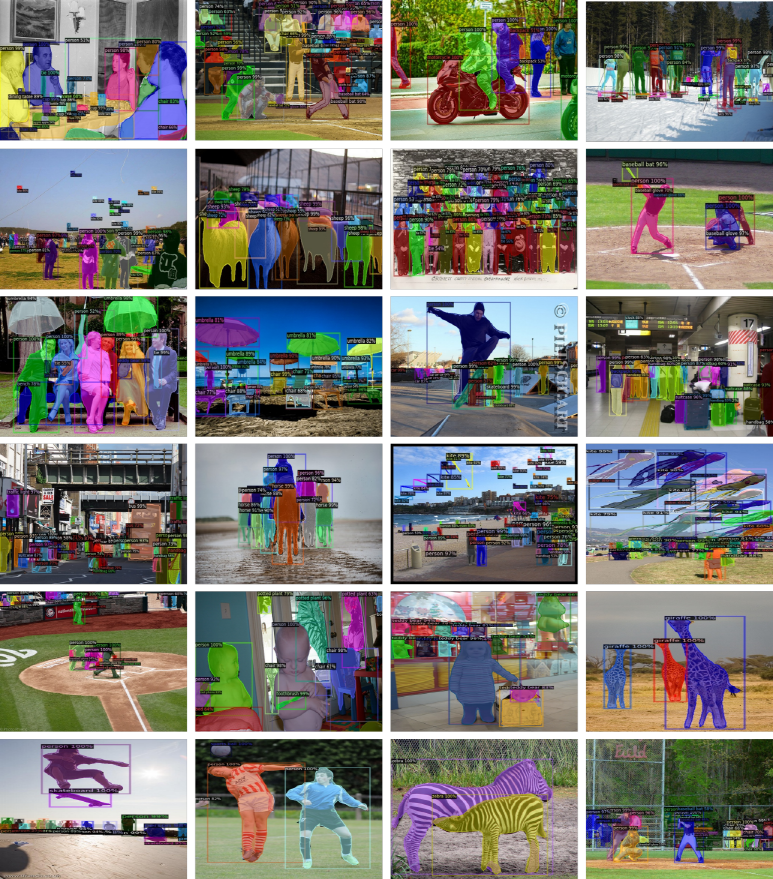

## AFI-GAN: Improving Feature Interpolation of Feature Pyramid Networks via Adversarial Training for Object Detection

A novel **feature interpolator** which can substitude for existing interpolation methods

This is the code page for our papers and implemented based on [detectron2](https://github.com/facebookresearch/detectron2).



## Abstract

Recent convolutional object detectors learn strong semantic features by combining features propagated from multiple pathways. 
To combine features with different resolutions,  coarser feature maps  are upsampled by using the simple interpolation (*e.g.,* nearest neighbor and bilinear) method. 
However, the simple interpolation incurs often noisy and blurred features. 
To resolve this, we propose a novel adversarially-trained interpolator, and which can substitute for the traditional interpolation effortlessly. 
In specific, we  design  AFI-GAN consisting of an AF interpolator and a feature patch discriminator. 
In addition, we present a progressive adversarial learning and AFI-GAN losses to generate multi-scale features for downstream detection tasks. However, we can also finetune the proposed AFI-GAN with the recent multi-scale detectors without the adversarial learning once a pre-trained AF interpolator is provided. 
We prove the effectiveness and flexibility of our AF interpolator, and achieve the better box and mask APs by **2.2%** and **1.6%** on average compared to using other interpolation. 
Moreover, we achieve an impressive detection score of **57.3%** mAP on the MSCOCO dataset.

### Highlights

* **Adversarially-trained feature interpolator:** For robust multi-scale object detection, the AF interpolator generates high quality of up-sampled features. To this end, we learn this interpolator via adversarial learning.
* **Progressive adversarial learning:** In order to avoid networks overfitted and improve the interpolation ability of AFI-GAN step-by-step for a specific detection task, we present progressive adversarial learning.
* **Substituting simple interpolation modules:** Substituting a simple interpolation module of multi-scale feature extractor (*e.g.* FPN, PAFPN, and BiFPN) with the AF interpolator achieves the accuracy improvements over using simple interpolation modules.
* **High flexibility over different backbones and detectors:** In practical, the AF interpolator is feasible to reuse although it is trained with other backbones and detection heads (*e.g.* RetinaNet, Faster R-CNN, Mask R-CNN, Cascade R-CNN, FCOS, and CenterMask).


### COCO test-dev results

|interpolation|Detection Head|Backbone|box AP|mask AP|Download
|:-------------:|:--------:|:--------:|:----:|:----:|:----------------:|
|NN|FCOS|R-50-FPN|39.7|-|-
|NN|FCOS|R-50-BiFPN|40.6|-|-
|NN|Mask R-CNN|R-50-FPN|39.0|35.5|-
|NN|Mask R-CNN|R-50-PAFPN|39.0|35.6|<a href="https://www.dropbox.com/s/djh2pyu3cue21m4/model_final.pth">model</a>
|NN|CenterMask|R-50-BiFPN|40.6|35.8|-
|NN|Cascade R-CNN<sup>&#9674;</sup>|Swin-T-BiFPN|48.3|-|-
|NN|Cascade R-CNN|S-101-PAFPN|48.6|41.9|<a href="https://www.dropbox.com/s/25yp5qz8dy7xj1e/model_final.pth">model</a>
||
|**AFI**|**FCOS**|R-50-FPN|**42.6**|-|-
|**AFI**|**FCOS**|R-50-BiFPN|**43.9**|-|-
|**AFI**|**Mask R-CNN**|R-50-FPN|**41.5**|**37.4**|-
|**AFI**|**Mask R-CNN**|R-50-PAFPN|**40.9**|**36.9**|<a href="https://www.dropbox.com/s/fcafpm6kq4zy960/model_final.pth">model</a>
|**AFI**|**CenterMask**|R-50-BiFPN|**43.8**|**38.2**|-
|**AFI**|**Cascade R-CNN**|S-101-PAFPN|**49.4**|**42.6**|<a href="https://www.dropbox.com/s/xf89z2r4nuenjpg/model_final.pth">model</a>
|**AFI**|**Cascade R-CNN<sup>&#9674;</sup>**|Swin-T-BiFPN|**51.7**|-|-
|**AFI**|**Cascade R-CNN<sup>&#8224;</sup>**|S-101-PAFPN|**51.6**|**44.7**|<a href="https://www.dropbox.com/s/xf89z2r4nuenjpg/model_final.pth">model</a>
|**AFI**|**Cascade R-CNN<sup>&#9674;&#8224;</sup>**|Swin-L-BiFPN|**57.3**|-|<a href="https://www.dropbox.com/s/tqyjyezcg0wo09f/model_final.pth">model</a>
* NN and AFI denote a nearest-neighbor interpolation method and the proposed method, respectively.
* S and Swin denote <a href="https://arxiv.org/abs/2004.08955">ResNeSt</a> backbone networks and <a href="https://arxiv.org/abs/2103.14030">swin-transfomer</a> backbone networks, respectively. 
* &#9674; and &#8224; represent COCO unlabeled set via self-training and multi-scale testing results, respectively.

## Installation

AFI-GAN is build on Detectorn2. We recommend to install <a href="https://github.com/facebookresearch/detectron2/tree/v0.1.1">Detectron2 v0.1.1</a>.<br> 
Please install the [detectron2 v0.1.1](https://github.com/facebookresearch/detectron2/tree/v0.1.1) in advance.

Prepare COCO dataset described below:
```
datasets/
    coco/
        {train,val,test}2017/
        annotations/
            instances_{train,val}2017.json
            image_info_test2017.json
```

For running the swin transfromer backbone, additional python packages are needed as below:
```bash
pip install timm==0.5.4
pip install dataclasses==0.8
```


## Training

Training code will be available soon.

## Evaluation

Model evaluation can be done as below:   
* if you want to inference with 1 batch `--num-gpus 1` 
* `--eval-only`
* `MODEL.WEIGHTS path/to/the/model.pth`
```bash
python3 run_net.py\
        --num-gpus 1\
        --eval-only\
        --config-file path/to/the/config-file.yaml\
        SOLVER.IMS_PER_BATCH 1\
        MODEL.WEIGHTS path/to/the/model.pth\
        OUTPUT_DIR path/to/the/directory
```
* if you want to inference with 8 batch `--num-gpus 8` 
```bash
python3 run_net.py\
        --num-gpus 8\
        --eval-only\
        --config-file path/to/the/config-file.yaml\
        SOLVER.IMS_PER_BATCH 8\
        MODEL.WEIGHTS path/to/the/model.pth\
        OUTPUT_DIR path/to/the/directory
```


## Qualitative Results

### Detection and Segmentation Results on COCO test-dev



### Interpolation Method Comparison using GCAM


## Thanks to

We referred below codes to conduct these experiments.
* [Detectron2](https://github.com/facebookresearch/detectron2)
* [CenterMask2](https://github.com/youngwanLEE/centermask2)
* [AdelaiDet](https://github.com/aim-uofa/AdelaiDet)
* [ResNeSt(Detectron2)](https://github.com/zhanghang1989/detectron2-ResNeSt)
* [Swin Transformer(Detectron2)](https://github.com/xiaohu2015/SwinT_detectron2)